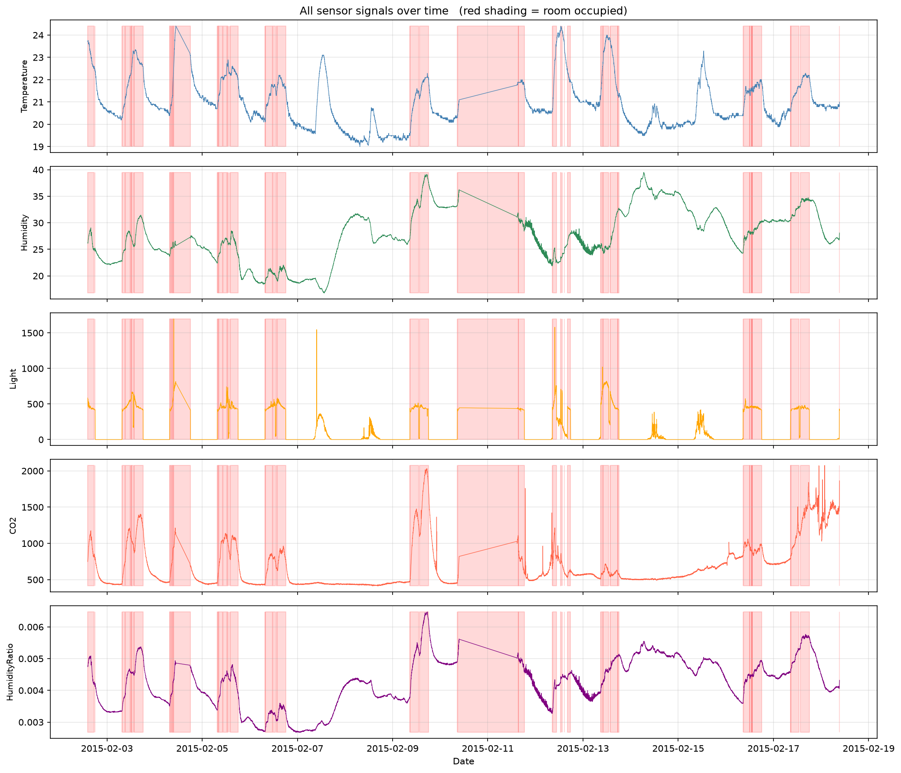
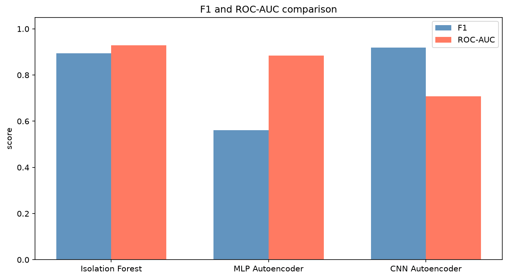
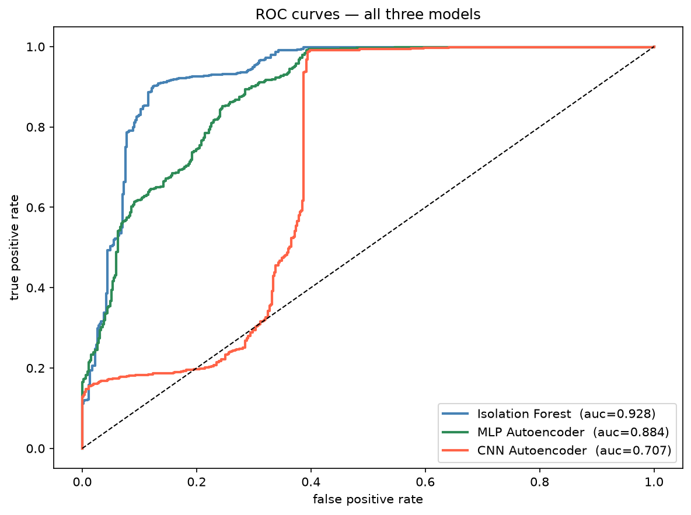

# Unsupervised Human Presence Detection from Indoor Sensor Signals

Detecting whether a room is occupied, using only sensor time-series and **no labeled anomalies during training**. Three anomaly detection methods are trained only on empty-room data and compared on the same test set: a classical baseline (Isolation Forest), a feedforward neural network (MLP Autoencoder), and a convolutional network that reads the signal as a sequence (CNN Autoencoder).

The central question: can a model that has only ever seen an empty room learn "normal" well enough to flag human presence as an anomaly, and does reading the temporal structure of the signal actually help?

This project was built for the AI Lab course at Sapienza University of Rome (Prof. Avola, Prometheus Lab).

```
git clone https://github.com/Nur2424/wifi-presence-detection
cd wifi-presence-detection
pip install -r requirements.txt
```

## The idea

The setup is **one-class (unsupervised)**. Each model is trained only on windows where the room was empty, so it learns what a normal empty room looks like. At test time it sees both empty and occupied windows. An occupied window is unfamiliar, so it gets a high anomaly score:

- **Isolation Forest** isolates unfamiliar points with fewer random cuts.
- **Autoencoders** rebuild empty windows well but rebuild occupied windows badly, so the reconstruction error is the anomaly score.

No occupied label is ever used in training. Labels are only used at the very end to measure how well the unsupervised scores separate the two classes.

## Data

[UCI Occupancy Detection dataset](https://archive.ics.uci.edu/dataset/357/occupancy+detection) — sensor readings from an office room sampled every minute over ~16 days, labeled occupied or empty. Loaded directly through `ucimlrepo`, no manual download needed.

Of the five available signals, only **Light** and **CO2** are used because they react most clearly to presence. The plot below shows all five signals over time, with occupied periods shaded red. Light jumps from near-zero to 400-800 whenever someone is present, and CO2 rises as people breathe, then falls slowly after they leave.



## What's in here

```
notebooks/
├── 01_load_data.ipynb          # load, clean, window, split, normalize
├── 02_isolation_forest.ipynb   # classical baseline
├── 03_mlp_autoencoder.ipynb    # feedforward autoencoder
├── 04_cnn_autoencoder.ipynb    # 1D convolutional autoencoder
└── 05_comparison.ipynb         # all three compared, ROC curves, conclusions

results/                        # all saved plots and score files
data/                           # prepared arrays (gitignored, regenerated by notebook 01)
```

## Method

**Windowing.** The minute-by-minute signal is cut into 30-minute overlapping windows (stride 5), each of shape `(30, 2)` for the two signals. A window is labeled occupied if anyone was present during any minute of it.

**Splitting by time, not randomly.** Because windows overlap, a random split would leak shared minutes between train and test. So the split is done in time order: the first 70% of empty windows for training, the next 15% for validation, the last 15% for test. All occupied windows go to the test set.

**Normalization.** Z-score normalization, with mean and standard deviation computed from the training set only and then applied to validation and test, so no test information leaks into training.

**Threshold.** For every model, the anomaly threshold is set at the 95th percentile of validation scores (validation is all empty). Keeping the threshold method identical across all three models is what makes the comparison fair.

## Models

| Model | Input | Reads time order? | Anomaly score |
|-------|-------|-------------------|---------------|
| Isolation Forest | 10 summary features per window | no | isolation depth |
| MLP Autoencoder | flattened window (60 values) | no | reconstruction error |
| CNN Autoencoder | window as a `(2, 30)` sequence | yes (local) | reconstruction error |

The Isolation Forest uses hand-crafted summary features (mean, std, min, max, range for each signal). The MLP flattens the window into an unordered vector of 60. The CNN keeps the sequence shape and uses 1D convolutions, so it can pick up local temporal patterns like a sharp CO2 rise.

## Results

All three trained only on empty windows, evaluated on the same mixed test set (452 empty, 1099 occupied).

| Model | Precision | Recall | F1 | ROC-AUC |
|-------|-----------|--------|------|---------|
| Isolation Forest | 0.953 | 0.843 | 0.895 | **0.928** |
| MLP Autoencoder | 0.948 | 0.399 | 0.561 | 0.884 |
| CNN Autoencoder | 0.858 | **0.988** | **0.919** | 0.707 |

| F1 and ROC-AUC | ROC curves |
|----------------|------------|
|  |  |

## What the results say

**No single model wins on every metric, and that is the interesting part.**

The **CNN Autoencoder** has the best F1 (0.919) and the highest recall (0.988) — it misses only 13 occupied windows out of 1099. Keeping the time order of the signal clearly helps detection.

The **Isolation Forest** has the best ROC-AUC (0.928). Its scores separate the two classes most cleanly across all thresholds. For a method with no neural network and only hand-crafted features, it is a strong and hard-to-beat baseline.

The **MLP Autoencoder** is the weakest. Flattening the window throws away the time structure, so many occupied windows end up with low reconstruction error because their average signal values resemble empty windows.

The F1-vs-AUC split comes down to calibration. The CNN flags aggressively: it catches almost everything but raises more false alarms (179 vs 46 for Isolation Forest), and its scores sit in a narrow band, which is why its threshold-independent AUC is low even though its F1 is high. Which model is "better" depends on the use case. For a security or energy-management system where missing presence is costly, high recall wins and the CNN is the right choice. Where false alarms are disruptive, the Isolation Forest is more reliable.

## Reproduce

Run the notebooks in order. Notebook 01 prepares the data and saves it for the others; notebooks 02-04 each train one model and save its scores; notebook 05 loads all scores and produces the comparison.

```
jupyter notebook notebooks/01_load_data.ipynb
```

All randomness is seeded (`seed=42`), so the numbers above reproduce exactly.

## What this is not

This is a course / portfolio project, not a deployment-ready system. It uses one public dataset from a single room, so the models have not been tested for generalization across different rooms, sensors, or seasons. The unsupervised setup assumes the training period is genuinely empty and that "normal" does not drift over time. A Transformer encoder was considered as a fourth model but left out to keep the project finishable within the deadline; it is the natural next step.

## Possible next steps

- Add a Transformer encoder autoencoder and compare attention against convolution.
- Test generalization by training on one room and testing on another.
- Add all five signals and measure whether the weaker ones (temperature, humidity) help.
- Replace the fixed 95th-percentile threshold with an adaptive one.

## Built on

A previous from-scratch study of backpropagation and neural network optimization ([microgradplus](https://github.com/Nur2424/microgradplus)) — the same MLP, autoencoder, MSE, and Adam foundations, here applied to a real signal-analysis problem in PyTorch.
