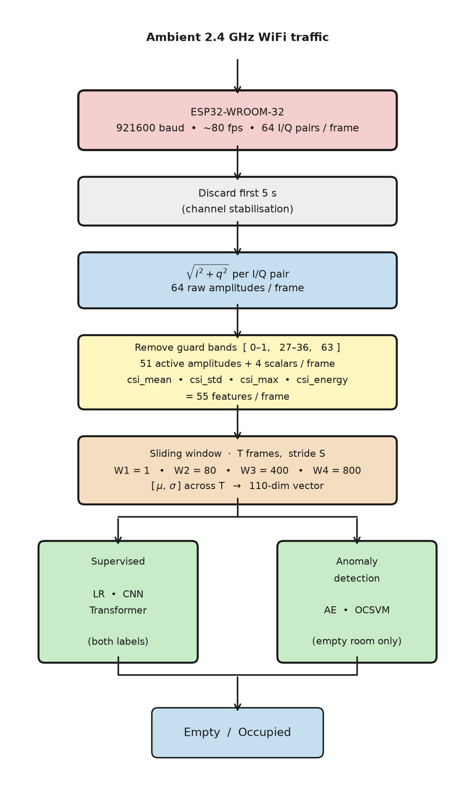
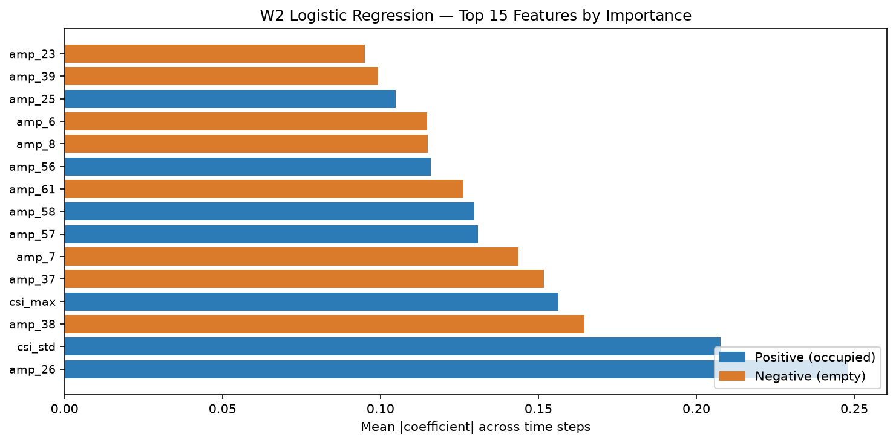
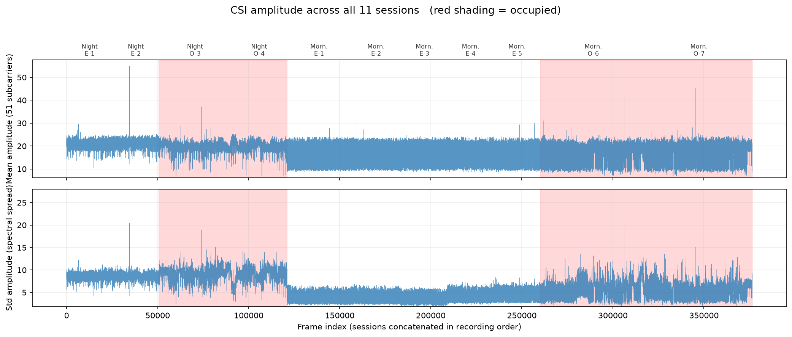
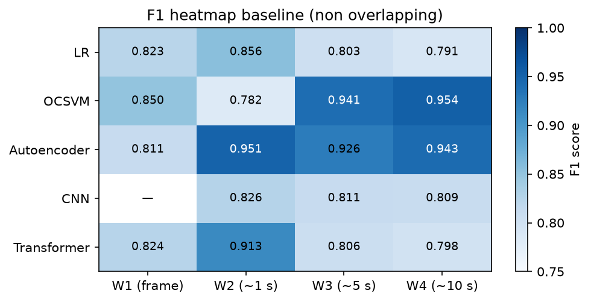
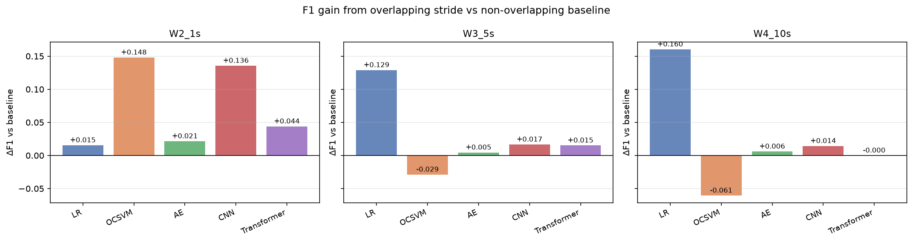
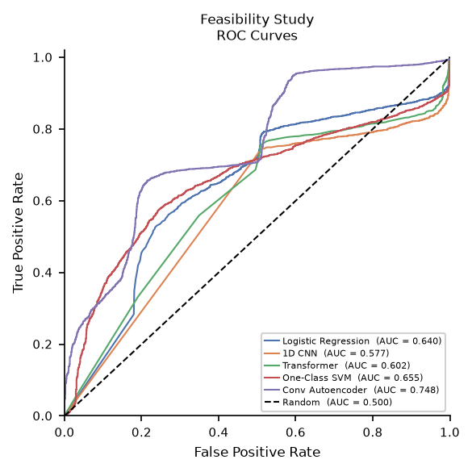
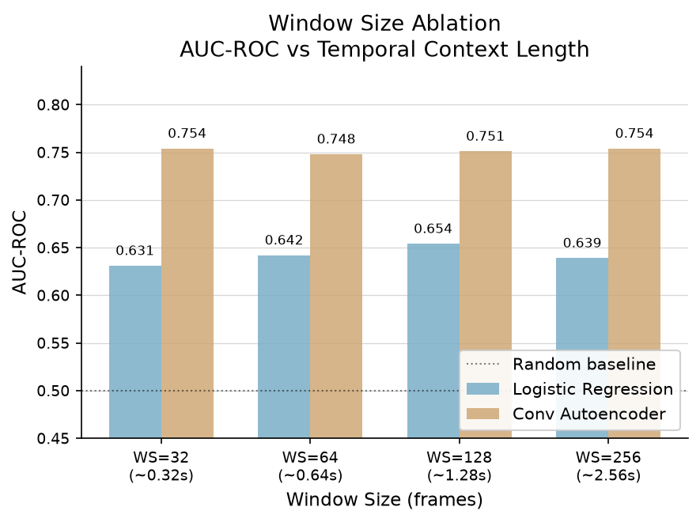
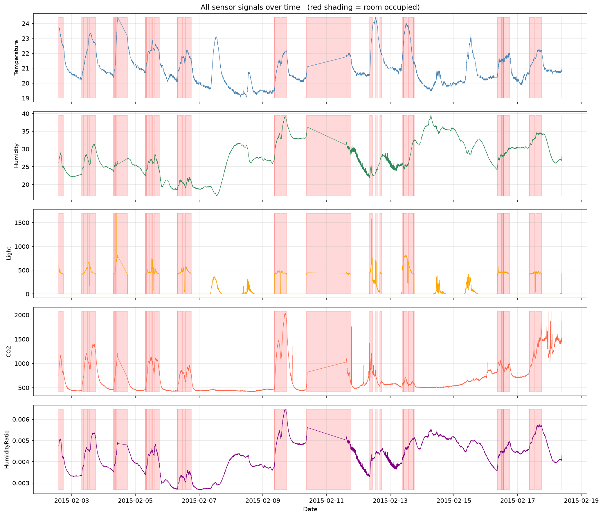
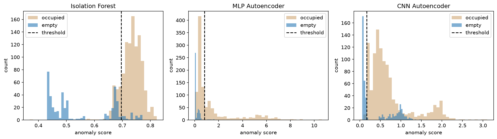

# wifi-presence-detection

Passive room occupancy detection from raw 802.11 Channel State Information no camera, no microphone, no dedicated sensor. An ESP32 captures 51 active OFDM subcarrier amplitudes from ambient 2.4 GHz traffic, sliding windows over those amplitudes distinguish an empty room from an occupied one with F1 up to **0.9725** across held-out sessions collected on different days and times.

Three substudies build on each other: a single session feasibility proof, a multi session study that confronts time of day RF drift, and a UCI public dataset benchmark that validates the anomaly detection framing beyond one hardware setup.

---

## Key Results

| Study | Model | Best configuration | F1 | AUC |
|---|---|---|---|---|
| Full study | Autoencoder | W2, stride 8 (~0.1 s) | **0.9725** | 0.9835 |
| Full study | CNN | W2, stride 8 (~0.1 s) | 0.9612 | 0.9857 |
| Full study | Transformer | W2, stride 8 (~0.1 s) | 0.9572 | 0.9825 |
| Full study | LR | W4, stride 560 (~7 s) | 0.9510 | 0.9549 |
| Full study | OCSVM | W4, no overlap (~10 s) | 0.9536 | **0.9935** |
| UCI benchmark | CNN Autoencoder | 30-frame window, 2 sensors | 0.919 | 0.707 |
| UCI benchmark | Isolation Forest | 200 estimators, hand crafted features | 0.895 | 0.928 |
| UCI benchmark | MLP Autoencoder | 30-frame window flattened | 0.508 | 0.884 |

---

## What this is

| Substudy | Scope | Key question |
|---|---|---|
| **Feasibility** | 2 sessions, 1 day | Is CSI amplitude separable at all? |
| **Full study** | 11 sessions, 2 days × 2 times of day | Does it hold across RF drift? |
| **UCI benchmark** | Public WiFi dataset | Does the anomaly detection framing transfer? |

Two model families are used throughout. **Supervised models** (LR, CNN, Transformer) are trained on labelled data from both classes. **One-class models** (Autoencoder, OCSVM) are trained only on empty room frames and flag occupied frames as anomalies at inference time.

## What this is not

- **A production sensor.** Labelling is manual and keyboard driven the ESP32 must remain in a fixed position relative to the access point.
- **A real time system.** The hardware logger writes to CSV, inference runs offline in Jupyter notebooks.
- **A claim of superiority over PIR or radar.** CSI is a signal that already exists in any WiFi connected space. This project asks what is learnable from it, not whether it beats dedicated hardware.
- **A curated result set.** Every anomaly in the numbers sample starvation at W3/W4, OCSVM degradation with strided overlap, MLP AE underperformance on the UCI benchmark appeared in the raw data first and required a mechanistic explanation before it went into the write-up.

---

## System Pipeline



The full pipeline: raw I/Q from the ESP32 -> amplitude conversion -> guard-band removal and scalar features -> sliding window aggregation -> parallel supervised and one-class branches -> binary output.

---

## Hardware & Data Collection

**Hardware:** [ESP32-WROOM-32 NodeMCU](https://www.amazon.it/-/en/dp/B0DKF9NCN1) — collects CSI via the esp-csi library at ~80 frames/s over 802.11b/g/n 2.4 GHz.

The ESP32 firmware (`esp-csi/examples/get-started/csi_recv_router`) reports raw I/Q pairs for 64 subcarriers at 921600 baud. `hardware/csi_logger.py` reads the serial stream, converts I/Q -> amplitude via **√(i² + q²)** per subcarrier pair, discards the first 5 seconds of each capture for hardware channel stabilisation, and writes labelled rows to CSV in real time. Labels are entered on the keyboard: `0` = empty, `1` = exist.

```bash
# Flash firmware + launch logger in one step
bash hardware/start.sh
```

`start.sh` loads ESP-IDF from `~/esp/esp-idf/export.sh`, autodetects the ESP32 serial port by scanning `/dev/cu.usbserial*`, flashes via `idf.py flash`, and opens the capture session one command from a cold start to live CSI collection.

**Raw CSV schema:**

```
time, label, rssi, noise, amp_0, amp_1, ..., amp_63
```

Eleven labelled sessions were collected across two days in the same room with the ESP32 in a fixed position relative to a phone hotspot which used as router: four night sessions and seven morning sessions, each containing both empty and occupied observations entered live via keyboard.

---

## Feature Engineering

The ESP32 reports 64 subcarrier indices, but most of the spectrum is guard bands and a DC null. After removing indices 0–1 (lower guard band edge), 27–36 (DC null and adjacent gap), and 63 (upper guard band edge), **51 active subcarriers** remain.

Four scalar statistics are computed per frame from the 51 amplitudes:

| Feature | Definition |
|---|---|
| `csi_mean` | Mean of 51 amplitudes |
| `csi_std` | Std of 51 amplitudes |
| `csi_max` | Max amplitude |
| `csi_energy` | Sum of squared amplitudes |

This gives **55 features per frame**. For the full study, each window of T frames is aggregated as \[mean, std\] across the time axis, producing a **110-dimensional vector** per window.

**Guard-band polarity.** Logistic regression feature importances expose an interpretable pattern: `amp_26` — the last active subcarrier before the gap at indices 27–36 — has the strongest positive weight, while `amp_37`–`amp_38`, the first active indices after the gap, have opposite sign. A polarity flip across the guard-band boundary is physically plausible given the multipath geometry near the DC null, this study does not isolate the underlying propagation mechanism. The pattern is a consistency check that the model responds to subcarrier structure rather than a global amplitude shift.



---

## Full Study — Multi-Session Evaluation

The full study tests cross session generalisation. Models are trained on one subset of sessions and evaluated on held-out sessions from a different day or time. The train/test split is always session level, no row level shuffling.

**The RF drift problem.** The ambient WiFi channel is not stationary. The empty room CSI baseline shifts between night (mean amplitude ~20–25) and morning (mean amplitude ~12–15) as temperature, humidity, and network load change. A model that memorises the night session empty room signature fails on morning sessions. The 11-session temporal overview makes the drift visible across the full dataset:



### Baseline — no overlapping windows

Four window sizes were evaluated against five model families:

| Window | Duration | Frames |
|---|---|---|
| W1 | ~12 ms | 1 |
| W2 | ~1 s | 80 |
| W3 | ~5 s | 400 |
| W4 | ~10 s | 800 |

At W3 and W4 without overlap, the dataset yields only 726 and 360 windows respectively. **Sample starvation not model capacity  is the binding constraint.**



All models plateau near W2, the gap between LR and deep models is narrow throughout which is the signature of a data limited regime rather than a capacity limited one.

### Overlapping windows and stride ablation

Strided window extraction replaces non-overlapping sampling. A sliding window of size T with stride S extracts far more training samples from the same raw data. Best strides per window:

| Window | Stride | Approx. gain |
|---|---|---|
| W2 (80 frames, ~1 s) | 8 rows (~0.1 s) | ~10× |
| W4 (800 frames, ~10 s) | 560 rows (7 s) | ~1.4× |

W3 is excluded: the optimal stride equals the window length (non-overlapping), meaning no overlap configuration improves sample count meaningfully at that scale.



**Best result: Autoencoder at W2 with stride 8 -> F1 = 0.9725, AUC = 0.9835, ~1 s observation window.**

Three findings worth noting:

1. **LR at W4 with stride 560 achieves F1 = 0.951**, competitive with every deep model. When 10 seconds of temporal context are available and the feature space is well specified, a linear classifier is nearly sufficient.

2. **OCSVM degrades with overlap at W3/W4.** Near duplicate windows, stride much smaller than window length, crowd the one-class hypersphere boundary, artificially tightening the decision region and increasing false positives. This is a property of kernel one-class methods, not a general failure of anomaly detection.

3. **Overlapping at W2 produces the largest gains across all models** because W2 is already at the scale where the CSI pattern is stable, and 8-row strides provide genuine diversity (0.1 s between samples) without near duplicates.

---

## Feasibility Study — Single-Session Proof of Concept

Before building a multi-session pipeline, the feasibility study asked whether CSI amplitude
is discriminative at all. Two sessions from the same day and room were used: one for
training, one for evaluation.

Five model families were tested: Logistic Regression, 1-D CNN, Transformer encoder,
Autoencoder (reconstruction error threshold), and One-Class SVM. Cross-session AUCs range
from 0.577 (CNN) to 0.746 (Conv Autoencoder) well above chance, but short of production
thresholds. The supervised models score lower not because of model weakness but because of
RF drift between sessions: a pattern learned in one session does not transfer cleanly to
another.



**Why the autoencoder leads.** Trained only on empty room frames, the AE learns the nominal
CSI distribution. When a person enters, reconstruction error spikes on patterns the model
has never seen. This one-class formulation is less sensitive to RF drift than supervised
models, which explains the AUC gap. The cross-session result of 0.746 confirms the signal
is real and motivates the full study's focus on multi-session robustness.

**Window size is not the bottleneck in single-session evaluation.**



AUC plateaus early across all models. Larger windows give marginal improvement but the discriminative signal is already present at small window sizes. The bottleneck in the full study (sample starvation at W3/W4) is a cross-session problem, not a signal-quality problem.

---

## UCI Benchmark — Public Dataset Validation

To test whether the anomaly detection framing transfers beyond the ESP32 hardware, the same
pipeline was applied to a public occupancy dataset from the UCI repository. Five environmental
sensors temperature, humidity, light, CO2, and humidity ratio were recorded continuously
across two weeks, with ground truth occupancy labels.



CO2 and light are the strongest visual discriminators: CO2 rises sharply during occupied
periods and light spikes correlate with activity. Temperature and humidity ratio drift more
slowly, reflecting thermal mass rather than immediate occupancy.

Three models were evaluated on this data:

| Model | F1 | AUC |
|---|---|---|
| CNN Autoencoder | **0.919** | 0.707 |
| Isolation Forest | 0.895 | **0.928** |
| MLP Autoencoder | 0.508 | 0.884 |



The CNN AE score distribution shows the clearest class separation. Isolation Forest achieves
comparable F1 via a complementary mechanism (average isolation depth), confirming the result
is not architecture specific. The MLP AE underperforms because flat subcarrier concatenation
loses the local spectral structure that convolutional receptive fields capture.

---

## How to Reproduce

### Requirements

- Python 3.10+
- CPU sufficient for all experiments, no GPU required

```bash
git clone https://github.com/<username>/wifi-presence-detection
cd wifi-presence-detection
pip install -r requirements.txt
```

### Data collection (raw data already included)

```bash
# Flash ESP32 firmware and start labelled capture
bash hardware/start.sh
```

### Full study

```bash
cd esp32/full-study-notebooks
jupyter notebook 00_preprocessing.ipynb       # session split, windowing, scaling
jupyter notebook 01_baseline_lr.ipynb         # logistic regression, window ablation
jupyter notebook 02_ocsvm.ipynb               # one-class SVM
jupyter notebook 03_autoencoder.ipynb         # autoencoder, reconstruction threshold
jupyter notebook 04_cnn.ipynb                 # 1-D CNN
jupyter notebook 05_transformer.ipynb         # transformer encoder
jupyter notebook 06_overlapping_windows.ipynb # strided window augmentation
jupyter notebook 07_final_results.ipynb       # combined tables and figures
```

### Feasibility study

```bash
cd esp32/feasibility-study-notebooks
jupyter notebook 00_preprocessing.ipynb
jupyter notebook 01_baseline_lr.ipynb
jupyter notebook 02_cnn_classifier.ipynb
jupyter notebook 03_transformer.ipynb
jupyter notebook 04_autoencoder.ipynb
jupyter notebook 05_ocsvm.ipynb
jupyter notebook 06_autoencoder_within_session2.ipynb
jupyter notebook 07_window_size_ablation.ipynb
jupyter notebook 08_long_window_lr.ipynb
jupyter notebook 09_figures.ipynb
```

### UCI benchmark

```bash
cd uci/uci-notebooks
jupyter notebook 01_load_data.ipynb
jupyter notebook 02_isolation_forest.ipynb
jupyter notebook 03_mlp_autoencoder.ipynb
jupyter notebook 04_cnn_autoencoder.ipynb
jupyter notebook 05_comparison.ipynb
```

---

## References

\[1\] Espressif Systems. *esp-csi: ESP-IDF component for WiFi CSI.* https://github.com/espressif/esp-csi

\[2\] Wang, W., Liu, A. X., Shahzad, M., Ling, K., & Lu, S. (2015). Understanding and modeling of WiFi signal based human activity recognition. *ACM MobiCom.* https://old.sigmobile.org/mobicom/2015/papers/p65-wangA.pdf

\[3\] Schölkopf, B., Platt, J. C., Shawe-Taylor, J., Smola, A. J., & Williamson, R. C. (2001). Estimating the support of a high dimensional distribution. *Neural Computation, 13*(7), 1443–1471. https://mlanthology.org/neco/2001/scholkopf2001neco-estimating

\[4\] Liu, F. T., Ting, K. M., & Zhou, Z.-H. (2008). Isolation forest. *IEEE ICDM.* https://sotaverified.org/papers/isolation-forest

\[5\] Halperin, D., Hu, W., Sheth, A., & Wetherall, D. (2011). Tool release: Gathering 802.11n traces with channel state information. *ACM SIGCOMM CCR, 41*(1), 53–53. https://unpaywall.org/10.1145%2F1925861.1925870
