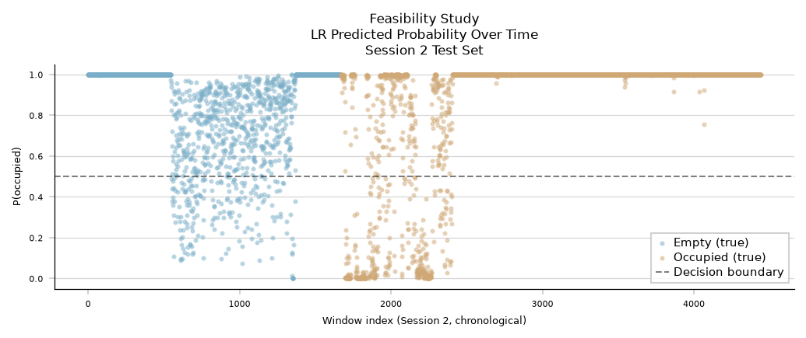

# WiFi CSI Presence Detection 
## Feasibility Study
 
**Goal:** Determine whether indoor presence (empty vs occupied room) can be detected from
WiFi Channel State Information (CSI) collected with a single ESP32, and identify the
dominant failure mode before investing in more complex solutions.
 
**Verdict:** Detection is feasible within a session (AUC ≈ 0.75 with an autoencoder), but
**cross session RF drift** is the bottleneck that no model in this study fully overcomes.
 
---
 
## Hardware and Signal
 
| Item | Detail |
|---|---|
| Device | ESP32 with `esp-idf` CSI extraction |
| Packet rate | ~100 Hz |
| Raw subcarriers | 64 (OFDM) |
| **Active subcarriers** | **51** (dropped: DC null @ idx 0, lower guard @ idx 1, upper guards @ idx 27–36, upper guard @ idx 63) |
| Features per frame | 55 (51 amplitudes + `csi_mean`, `csi_std`, `csi_max`, `csi_energy`) |
| Amplitude formula | √(I² + Q²) per subcarrier |
 
---
 
## Dataset
 
Two back-to-back recording sessions in the same room:
 
| Split | Session | Frames | Windows (WS=32, step=16) |
|---|---|---|---|
| Train | Session 1 | 71 516 | 4 467 |
| Test | Session 2 | 71 112 | 4 442 |
 
**Why session-based splitting?** Random splits leak temporal autocorrelation and produce
inflated test scores. Session 2 is a strict held out test of cross session generalisation
the condition that matters for a real deployment.
 
**Windowing:** A sliding window of 32 frames (~0.32 s at 100 Hz) is applied within each label
independently, with 50 % overlap (step = 16). Windowing within each label prevents any
window from straddling an empty => occupied boundary.
 
---
 
## Notebooks
 
| Notebook | Model | Cross-session AUC |
|---|---|---|
| `01_baseline_lr.ipynb` | Logistic Regression | 0.640 |
| `02_cnn_classifier.ipynb` | 1D CNN | 0.582 |
| `03_transformer.ipynb` | Transformer | 0.669 |
| `04_autoencoder.ipynb` | Conv Autoencoder (anomaly detection) | **0.747** |
| `05_ocsvm.ipynb` | One-Class SVM | 0.655 |
| `06_autoencoder_within_session2.ipynb` | AE — intra-session test | 0.627 |
| `07_window_size_ablation.ipynb` | LR + AE across WS ∈ {32, 64, 128, 256} | — |
| `08_long_window_lr.ipynb` | LR with WS = 512 | — |
| `09_figures.ipynb` | Final publication figures | — |
 
---
 
## Key Finding: Cross Session Drift
 
Every supervised model (LR, CNN, Transformer) scores near chance (AUC 0.58–0.67) on
Session 2 despite perfect training accuracy. The room's RF environment affected by
furniture position, temperature, humidity and device orientation shifts between sessions,
so the decision boundary learned from Session 1 no longer separates classes in Session 2.
 
The **Conv Autoencoder** (notebook 04) partially sidesteps this by training only on
Session 1 *empty* frames and flagging high reconstruction error as "occupied". It achieves
the best cross session AUC (0.747) but still suffers from the same drift: the empty
distribution in Session 2 differs from Session 1, producing a bimodal reconstruction error
histogram for the empty class (see figure below).
 
Notebook 06 confirms that intra session detection is also imperfect (AUC 0.627), showing
drift occurs even within a single session as the environment slowly evolves.
 
---
 
## Figures
 
### ROC Curves (cross-session)


The Conv Autoencoder dominates. Supervised models cluster near the diagonal,
confirming that learned boundaries from Session 1 do not transfer to Session 2.

### LR Predictions Over Time



LR predictions on Session 2 in chronological order. Empty frames (blue) in the
opening segment are classified as occupied with near certainty the boundary
learned from Session 1 does not transfer. This confirms that RF drift, not model
capacity is the limiting factor and sets the direction for the full study.

### Window Size Ablation


The autoencoder is largely insensitive to window size (AUC 0.748–0.754). LR improves
slightly with more temporal context but plateaus around WS = 128. The gain is small
relative to the drift bottleneck, so WS = 32 (~0.32 s) is a reasonable default.
 
---
 
## Running the Notebooks
 
```bash
pip install numpy scipy scikit-learn torch matplotlib
# data must be at ../data/feasibility-study/processed/
jupyter lab
```
 
Run notebooks 01–07 in order. Each notebook saves intermediate data to `plot_data/`.
Run `09_figures.ipynb` last to generate the figures above into `figures/`.
 
---
 
## What We Did Next


The feasibility study revealed three clear limitations:

- **Static occupancy behaviour** - during recording, the occupied sessions consisted of sitting still in one position, which produced CSI patterns closer to an empty room than real presence.
- **Limited data diversity** — both sessions were recorded back to back at the same time of day. The RF environment (temperature, humidity, multipath geometry) was nearly identical, giving models little exposure to natural session to session variation.
- **Small dataset** — ~71 k frames per session is enough to probe feasibility but too little for deeper models to generalise.

The full study (`../full-study-notebooks/`) addressed all three:

1. **More diverse sessions** — recordings spread across morning and evening, capturing genuine environmental drift across times of day.
2. **Natural movement** — occupied sessions included realistic body movement, not static sitting.
3. **Overlapping windows** — 50 % overlap significantly increased the number of training windows from the same raw frames, giving larger models more samples to learn from.
4. **Wider model sweep** — all five architectures (LR, OCSVM, Autoencoder, CNN, Transformer) retested across four window sizes with both no overlapping and overlapping splits.

**Best result:** Conv Autoencoder with overlapping W2 windows **F1 = 0.9725, AUC = 0.9835** a substantial leap over the 0.747 AUC ceiling hit here.