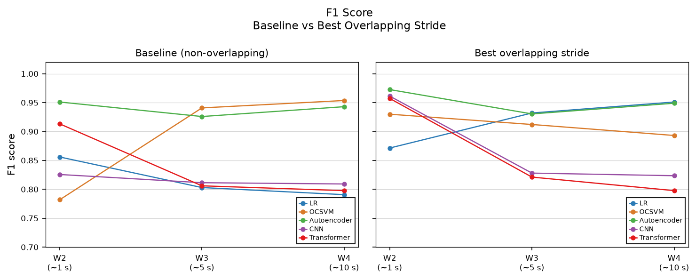
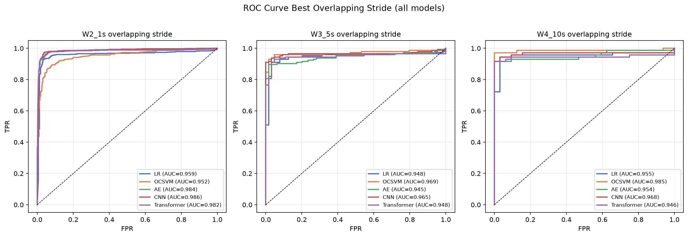

# WiFi CSI Presence Detection
## Full Study

Binary room occupancy classification from ESP32 Channel State Information (CSI).
This folder contains the complete study pipeline: data collected across **11 recording
sessions on 2 days**, 5 models, and a stride ablation experiment that identifies the
best training configuration for each model.

> **This is the full study.** An earlier feasibility pass lives in
> `feasibility-study-notebooks/` and used a two-session single day dataset to confirm
> whether CSI alone could separate the two classes. The notebooks here use the full 11-session dataset, proper cross day
> held-out evaluation, and a more deep experimental design.

> **Key Finding:** Overlapping training windows are the single biggest lever sample
> starvation not model capacity was the bottleneck.
>
> Rather than collecting more data, sliding the training window with a dense stride
> multiplies the number of training samples from the same recordings and preserves
> patterns that non-overlapping cuts across window boundaries.
>
> The gains are stacking: LR at W4 went from F1 0.791 to 0.951 (+0.160), CNN at W2
> from 0.826 to 0.961 (+0.136) both reaching levels previously only the Autoencoder
> held at baseline. The best overall model remains the Autoencoder at W2 with 0.1 s
> stride (F1 0.973, AUC 0.984).
>
> With a larger and more diverse dataset, CNN and Transformer may pull ahead their
> inductive biases (local kernels, self-attention) are better suited to capturing real
> motion patterns, but cannot be verified at this data scale.

---

## Notebooks

| # | Notebook | What it does |
|---|----------|--------------|
| 00 | `00_preprocessing.ipynb` | Loads raw CSI CSVs, extracts 51 subcarrier amplitudes + 4 scalar stats, segments into windows (W1–W4), saves train/test splits |
| 01 | `01_baseline_lr.ipynb` | Logistic Regression baseline across all 4 window sizes (seed 42) |
| 02 | `02_ocsvm.ipynb` | One-Class SVM trained on empty room windows only, RBF kernel nu=0.05 |
| 03 | `03_autoencoder.ipynb` | FC autoencoder (110 -> 64 -> 16 -> 64 -> 110) reconstruction error anomaly detector |
| 04 | `04_cnn.ipynb` | 1D CNN local temporal pattern classifier (W2–W4), W1 excluded by design) |
| 05 | `05_transformer.ipynb` | CLS token Transformer with positional positional encoding |
| 06 | `06_overlapping_windows.ipynb` | Training stride sweep (W2–W4), best stride selected per window via LR AUC averaged over 3 seeds, all 5 models reevaluated at best stride |
| 07 | `07_final_results.ipynb` | Consolidated comparison: baseline tables, heatmap, ΔF1 chart, conclusions |

---

## Data

**Features:** 55 per frame, 51 subcarrier amplitudes + `csi_max`, `csi_energy`, `csi_mean`, `csi_std`.

**Sessions:** 11 recording sessions across 2 days (4 night sessions, 7 morning sessions).
Labels: `empty` (room unoccupied) and `exist` (room occupied).


Mean and std amplitude across all sessions concatenated in recording order.
Occupied sessions (red shading) show elevated variance. The amplitude shift between
night and morning sessions reflects RF drift the channel baseline changes across days
and times of day, which is the central challenge this study.

**Window sizes:**

| ID | Frames | Duration | Aggregated shape |
|----|--------|----------|-----------------|
| W1 | 1      | ~12 ms   | (55,) — frame level |
| W2 | 80     | ~1 s     | (110,) — mean+std |
| W3 | 400    | ~5 s     | (110,) |
| W4 | 800    | ~10 s    | (110,) |

Windows aggregate (N, T, 55) -> (N, 110) via mean and std concatenated across
the time axis (`aggregate_window()`).

**Test set (held out, cross-day):** `session5_morning_empty` and
`session7_morning_occupied`. Test windows are always no overlapping regardless of training stride.

---

## Key Results

| Configuration | F1 | AUC | Latency |
|---|---|---|---|
| **Autoencoder with W2, 0.1 s stride** | **0.9725** | 0.9835 | ~1s |
| CNN with W2, 0.1s stride | 0.9612 | **0.9857** | ~1s |
| Transformer with W2, 0.1s stride | 0.9572 | 0.9825 | ~1 s |
| OCSVM with W4, non-overlapping | 0.9536 | 0.9935 | ~10s |
| LR with W4, 7s stride | 0.9510 | 0.9549 | ~10s |

---



At baseline (non-overlapping), models split clearly Autoencoder and OCSVM reach
~0.95 at W2 while CNN, LR, and Transformer lag behind. After applying the best
overlapping stride, the gap closes significantly: CNN jumps from 0.826 to 0.961 at W2,
LR from 0.791 to 0.951 at W4. Sample starvation at longer windows not model capacity,
was the bottleneck.

---



With best stride overlapping, all models reach AUC > 0.95 at W2. CNN (0.986) and
Autoencoder (0.984) lead, but the spread is narrow the overlapping window strategy
levels the playing field across architectures.

---

## How to Run

Run notebooks in order: `00` -> `01` -> ... -> `07`.
Notebook `00` must run first it generates the windowed datasets that all subsequent notebooks load.

**Dependencies:**

```
numpy
pandas
scikit-learn
torch
matplotlib
jupyter
pyserial          # only needed for hardware data collection
```

Install:

```bash
pip install numpy pandas scikit-learn torch matplotlib jupyter
```

---

## Hardware & Data Collection

Raw data was collected with an **ESP32** running Espressif's CSI-enabled firmware.
The logger script is at `hardware/csi_logger.py`.

**Usage:**

```bash
python hardware/csi_logger.py --port /dev/cu.usbserial-0001
```

Keys during recording: `0` = empty, `1` = exist, `S` = start/resume,
`P` = pause, `Q` = quit. A 5-second warmup is discarded after each label
switch to avoid transient channel effects at boundaries.

Raw CSVs are saved to `esp32/data/full-study/raw/` and picked up by `00_preprocessing.ipynb`.