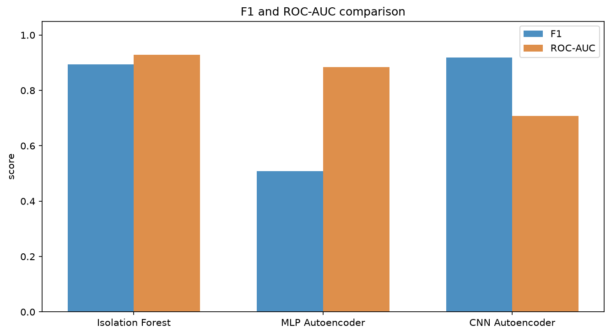
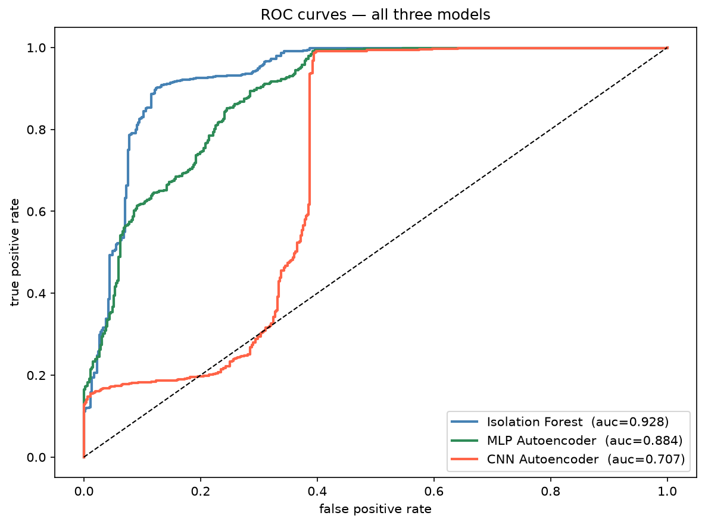

# Unsupervised Human Presence Detection from Indoor Sensor Signals

Detecting whether a room is occupied, using only sensor time series and **no labeled anomalies during training**. Three anomaly detection methods are trained only on empty room data and compared on the same test set: a classical baseline (Isolation Forest), a feedforward neural network (MLP Autoencoder), and a convolutional network that reads the signal as a sequence (CNN Autoencoder).

The central question: can a model that has only ever seen an empty room learn "normal" well enough to flag human presence as an anomaly, and does reading the temporal structure of the signal actually help?

```bash
git clone https://github.com/Nur2424/wifi-presence-detection
cd wifi-presence-detection
pip install -r requirements.txt
```

## The idea

The setup is **one class (unsupervised)**. Each model is trained only on windows where the room was empty, so it learns what a normal empty room looks like. At test time it sees both empty and occupied windows. An occupied window is unfamiliar, so it gets a high anomaly score:

- **Isolation Forest** isolates unfamiliar points with fewer random cuts.
- **Autoencoders** rebuild empty windows well but rebuild occupied windows badly, so the reconstruction error is the anomaly score.

No occupied label is ever used in training. Labels are only used at the very end to measure how well the unsupervised scores separate the two classes.

## Data

[UCI Occupancy Detection dataset](https://archive.ics.uci.edu/dataset/357/occupancy+detection) — sensor readings from an office room sampled every minute over ~16 days, labeled occupied or empty. Loaded directly through `ucimlrepo`, no manual download needed.

Of the five available signals, only **Light** and **CO2** are used because they react most clearly to presence. The plot below shows all five signals over time, with occupied periods shaded red.


## Method

**Windowing.** The minute by minute signal is cut into 30-minute overlapping windows (stride 5), each of shape `(30, 2)` for the two signals. A window is labeled occupied if anyone was present during any minute of it.

**Splitting by time, not randomly.** Because windows overlap, a random split would leak shared minutes between train and test. So the split is done in time order: the first 70% of empty windows for training, the next 15% for validation, the last 15% for test. All occupied windows go to the test set.

**Normalization.** Z-score normalization, with mean and standard deviation computed from the training set only and then applied to validation and test.

**Threshold.** For every model, the anomaly threshold is set at the 95th percentile of validation scores (validation is all empty). Keeping the threshold method identical across all three models is what makes the comparison fair.

## Models

| Model | Input | Reads time order? | Anomaly score |
|-------|-------|-------------------|---------------|
| Isolation Forest | 10 summary features per window | no | isolation depth |
| MLP Autoencoder | flattened window (60 values) | no | reconstruction error |
| CNN Autoencoder | window as a `(2, 30)` sequence | yes (local) | reconstruction error |

Notebooks are in `uci-notebooks/`, outputs in `uci-outputs/`.

## Results

All three trained only on empty windows, evaluated on the same mixed test set (452 empty, 1099 occupied).

| Model | Precision | Recall | F1 | ROC-AUC |
|-------|-----------|--------|------|---------|
| Isolation Forest | 0.953 | 0.843 | 0.895 | **0.928** |
| MLP Autoencoder | 0.948 | 0.399 | 0.561 | 0.884 |
| CNN Autoencoder | 0.858 | **0.988** | **0.919** | 0.707 |

| F1 and ROC-AUC | ROC curves |
|----------------|------------|
|  |  |

## What the results say

**No single model wins on every metric, and that is the interesting part.**

The **CNN Autoencoder** has the best F1 (0.919) and the highest recall (0.988) it misses only 13 occupied windows out of 1099. Keeping the time order of the signal clearly helps detection.

The **Isolation Forest** has the best ROC-AUC (0.928). Its scores separate the two classes most cleanly across all thresholds. A strong and hard to beat baseline with no neural network and only hand crafted features.

The **MLP Autoencoder** is the weakest. Flattening the window throws away the time structure, so many occupied windows end up with low reconstruction error because their average signal values resemble empty windows.

The F1 vs AUC split comes down to calibration. The CNN flags aggressively: it catches almost everything but raises more false alarms (179 vs 46 for Isolation Forest). Which model is "better" depends on the use case for a security or energy management system where missing presence is costly, high recall wins. Where false alarms are disruptive, the Isolation Forest is more reliable.

## What this is not

This is a course / portfolio project, not a deployment ready system. It uses one public dataset from a single room. The unsupervised setup assumes the training period is genuinely empty and that "normal" does not drift over time.

## What we did next

This UCI study confirmed that the one class anomaly detection approach is viable. We then extended it to **real WiFi CSI signals** collected with an ESP32 a harder problem because the signal drifts across sessions due to environmental change. After collecting 7 sessions across multiple days and times of day, the best model (Conv Autoencoder with overlapping 1-second windows) reached **F1 = 0.9725, AUC = 0.9835** on a held out cross day test set. See `feasibility-study-notebooks/` and `full-study-notebooks/` for the full pipeline.